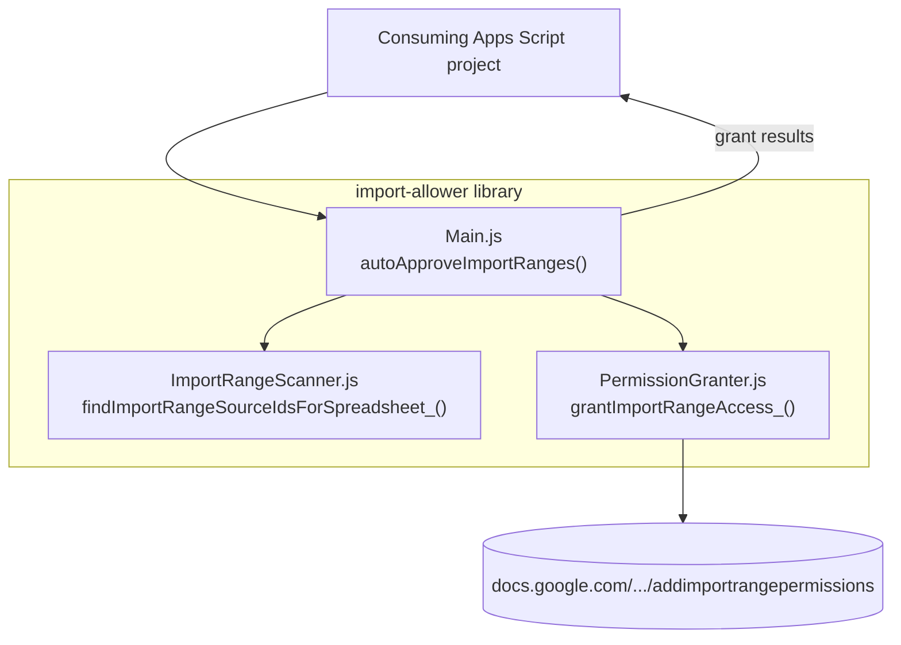

# import-allower

A Google Apps Script library that scans a Google Sheets spreadsheet for every `IMPORTRANGE` it uses, and silently grants access to each source spreadsheet — no manual "Allow access" click.

## Why

`IMPORTRANGE`'s cross-spreadsheet access grant has to be approved once per *(destination, source)* pair, through a click-through dialog that only appears in the Sheets UI. That's a minor nuisance for a single import, but it gets tedious fast when a spreadsheet imports from many sources, or when a spreadsheet gets copy-pasted/duplicated — the copy has a new file ID, so every source it imports from needs to be re-approved from scratch even though the original already had access. This library finds every source a spreadsheet actually references and grants access to all of them in one call, by hitting the same undocumented endpoint the "Allow access" button itself calls.

It detects `IMPORTRANGE` wherever it appears — a lone formula, one nested inside another function (e.g. `VLOOKUP(A1, IMPORTRANGE(...), 2, 0)`), or several `IMPORTRANGE` calls combined in a single formula (e.g. joined with `&`, or as separate items in an array literal) — across every sheet in the spreadsheet.

## Deploying the library

1. Open the project in the Apps Script editor (`clasp open`, or push first with `clasp push` if you've made local changes). Only `src/` is deployed — `.clasp.json` must keep `"rootDir": "src"`, so re-add it if you re-run `clasp clone`/`clasp create`.
2. **Deploy > New deployment**, select type **Library**, and create the deployment. Note the **Script ID** shown under **Project Settings** (also the `scriptId` in this repo's `.clasp.json`).
3. Each time you change the library's code, cut a new deployment version (or a new deployment) — consuming projects pin to a specific version number, so old versions keep working until the consumer explicitly updates.

## Connecting the library in another project

1. In the consuming project's Apps Script editor: **Libraries** (left sidebar) > **Add a library**.
2. Paste the library's Script ID, click **Look up**, pick the version to use, and set an identifier (e.g. `ImportAllower`) — this identifier is the namespace you'll call functions through.
3. Add the [required scopes](#required-scopes-in-the-consuming-project) below to the consuming project's own `appsscript.json` — the library's own manifest scopes are not inherited automatically.

## Usage

```js
// Grant access to every IMPORTRANGE source in the active spreadsheet
// (only resolvable from a container-bound script or trigger)
const results = ImportAllower.autoApproveImportRanges();

// Or target a specific spreadsheet by ID
const results = ImportAllower.autoApproveImportRanges('SPREADSHEET_ID');

// results: [{ sourceId, ok, httpStatus, responseText }, ...] — one per unique source found
results.forEach(r => {
  if (!r.ok) Logger.log(`Failed to grant access to ${r.sourceId}: ${r.responseText}`);
});
```

### Running automatically on every edit

Apps Script always resolves an installable trigger's handler function against the *calling* project's own global scope — a trigger can't point directly at a library-qualified function like `ImportAllower.autoApproveImportRanges`. Define a one-line wrapper in the consuming project and install the trigger against that:

```js
function onEditAutoApprove(e) {
  ImportAllower.autoApproveImportRanges();
}

// Run once, manually, from the Apps Script editor to install the trigger:
function setup() {
  ImportAllower.installAutoApproveTrigger('onEditAutoApprove');
}
```

### Troubleshooting

```js
// Logs every IMPORTRANGE cell's formula and the source ID(s) detected in it
ImportAllower.logImportRangeFormulas();

// Just the detection step, without granting anything
const sourceIds = ImportAllower.findImportRangeSourceIds();
```

`spreadsheetId` is optional on every public function — if omitted, the library falls back to `SpreadsheetApp.getActiveSpreadsheet()`, which only resolves when called from a bound script context (a container-bound script or a simple/installable trigger); calling it without `spreadsheetId` from a standalone script or webapp throws.

### Required scopes in the consuming project

Apps Script's automatic scope detection only scans a project's own code, not the code of libraries it depends on. Any project that adds this library as a dependency must **also** declare these scopes in its own `appsscript.json`, or calls into this library will fail with an authorization error:

```json
"oauthScopes": [
  "https://www.googleapis.com/auth/spreadsheets",
  "https://www.googleapis.com/auth/script.external_request",
  "https://www.googleapis.com/auth/script.scriptapp"
]
```

Drop `script.scriptapp` if you never call `installAutoApproveTrigger`.

## How it works



`ImportRangeScanner.js` reads every sheet's formulas directly (via `getFormulas()`) to locate every cell whose formula mentions `IMPORTRANGE` — including a spilled array-literal formula like `={IMPORTRANGE(...);IMPORTRANGE(...)}`, where only the anchor cell holds the formula text — then walks each formula's text to find every `IMPORTRANGE(...)` call (not just the first) and pull out its first argument — a quoted URL/ID literal, or an unquoted cell reference, which is resolved by reading that cell's value. Each resolved value is reduced to a bare spreadsheet ID (whether it started as a full URL or an ID literal) and deduplicated across the whole spreadsheet.

`PermissionGranter.js` then POSTs one request per unique source ID to the same internal `addimportrangepermissions` endpoint the Sheets UI's "Allow access" button calls, using the running user's own OAuth token — so the user must already have at least view access to each source, or the grant request itself will fail (this library records access grants, it doesn't bypass Drive sharing).

Requests are sent in batches of 10 (via `UrlFetchApp.fetchAll`) rather than all at once, and each batch's results are written to the log as soon as they're known — so with many sources you'll see grant results appear incrementally in the execution log rather than only after the whole scan finishes.

Nothing about the destination spreadsheet's content is ever modified — this only affects the (destination, source) access-grant record.

## Known limitations

- **Undocumented endpoint.** `addimportrangepermissions` isn't a published Google API; it could change or be retired without notice. If access stops being granted, check the response body logged for each source (`responseText` in the returned results) for clues before assuming the detection step is at fault.
- **Only literal/cell-reference source arguments are resolved.** If an `IMPORTRANGE`'s first argument is a computed expression (e.g. `CONCATENATE("https://...", B1)`) rather than a plain string literal or a single cell reference, it won't be resolved and that source will be silently skipped.
- **View access is a prerequisite, not a side effect.** This grants the *IMPORTRANGE-specific* permission record, not general spreadsheet access — the running user needs to already be able to open each source spreadsheet.

## Testing

Run `npm run check` (ESLint, a `checkJs` type check over `src/`, and the unit tests) before pushing. The unit tests (`npm run test`, Node's built-in test runner) cover the pure `IMPORTRANGE` formula parsing in `src/ImportRangeScanner.js`. Everything that calls `SpreadsheetApp` or `UrlFetchApp` can only run inside Apps Script, so that behavior is tested manually from the Apps Script editor against a scratch spreadsheet:

1. Add several `IMPORTRANGE` formulas across different sheets: a plain one, one nested inside another function (e.g. `SUM(IMPORTRANGE(...))`), one formula combining two `IMPORTRANGE` calls with `&` (e.g. `IMPORTRANGE(id1, "A:B") & IMPORTRANGE(id2, "A:B")`), and one array-literal formula combining two `IMPORTRANGE` calls (e.g. `={IMPORTRANGE(id1, "A1");IMPORTRANGE(id2, "A1")}`). Use at least one source spreadsheet the destination has never been granted access to before.
2. Run `logImportRangeFormulas()` first and confirm every `IMPORTRANGE` cell is listed with the correct source ID(s) extracted, including both IDs from the combined formula.
3. Run `autoApproveImportRanges()` and confirm every result has `ok: true`.
4. Reload the spreadsheet and confirm the previously-blocked cells now show real data instead of a "needs permission" / `#REF!` error, with no manual click required.
5. To test the trigger path: add the wrapper + `installAutoApproveTrigger` setup shown above to a *consuming* test project, add a brand-new `IMPORTRANGE` to a new source, edit the sheet, and confirm the source gets auto-approved without running anything manually.
